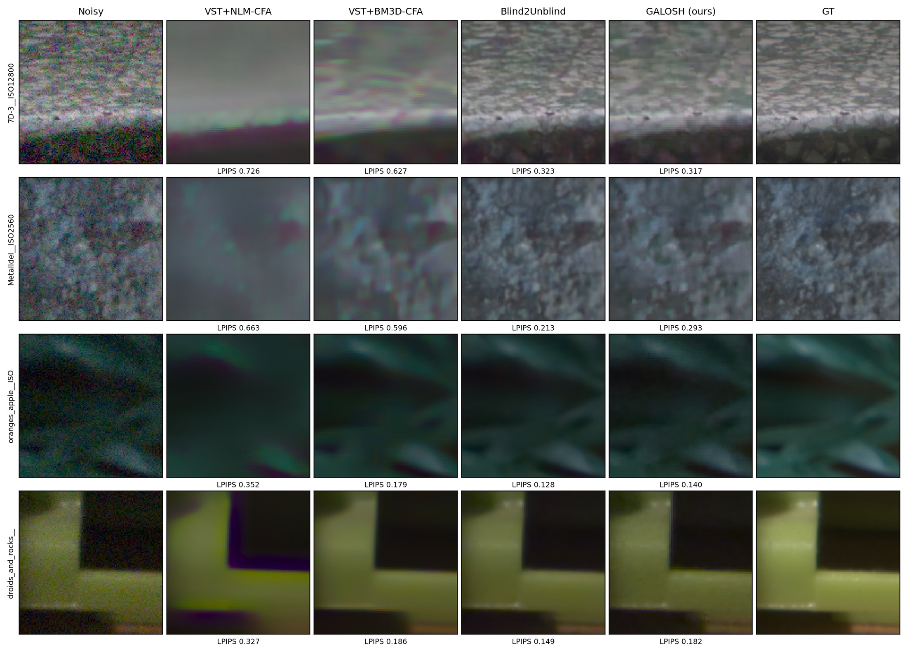
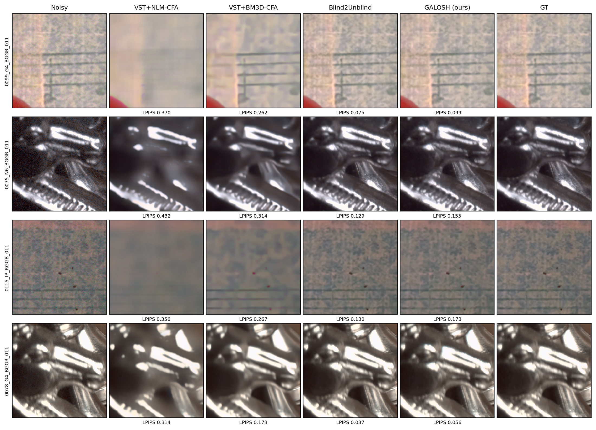
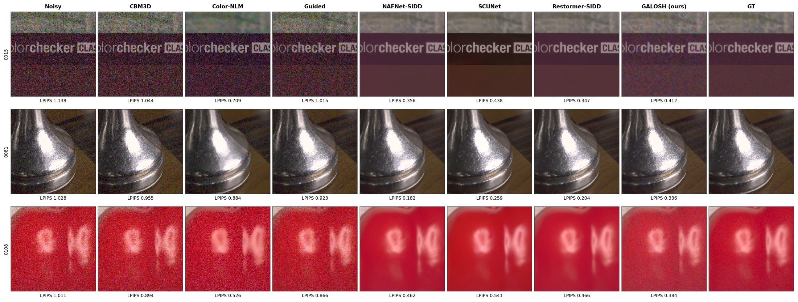
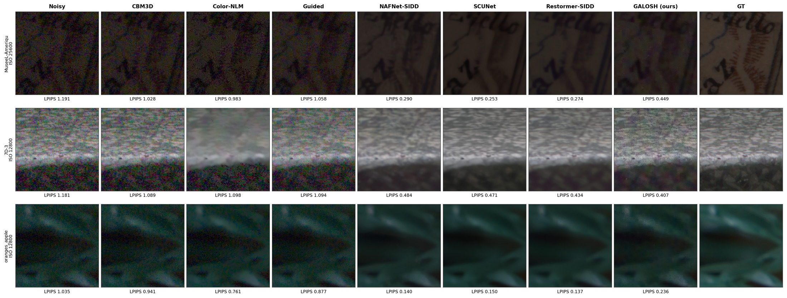

# GALOSH

[](https://doi.org/10.5281/zenodo.21187219)
[](LICENSE)

**Blind, training-free denoising of raw Bayer and sRGB/YUV images by
parallel-friendly local shrinkage.**

Preprint: [PDF (English)](https://github.com/luxgrain/GALOSH/releases/download/v0.1.0/galosh_paper.pdf)
· [日本語版 PDF (Japanese translation)](https://github.com/luxgrain/GALOSH/releases/download/v0.1.0/galosh_paper_ja.pdf)
· [Zenodo (DOI 10.5281/zenodo.21187219)](https://doi.org/10.5281/zenodo.21187219)
· [arXiv:2607.03768](https://arxiv.org/abs/2607.03768)

📦 **Download** — Windows standalone builds, no install needed: drag & drop a
DNG or PNG onto the exe ([Releases](https://github.com/luxgrain/GALOSH/releases))

🎬 **Video workflows** — VapourSynth / AviSynth+ plugin (one DLL, output
byte-identical to the reference implementation):
[GALOSH-frameserver](https://github.com/luxgrain/GALOSH-frameserver)

GALOSH (Generalized Anscombe LOcal SHrinkage) is a **classical** image denoiser
redesigned for modern parallel hardware:

- **Blind** — the Poisson–Gaussian noise model is estimated from the input
  image itself; no calibration data, no per-image noise oracle.
- **Training-free** — no learned weights; generalizes across sensors and
  datasets by construction.
- **Search-free** — unlike BM3D/NLM there is no block matching or neighborhood
  search: every stage is local, regular, and data-independent, so the same
  fixed computation graph runs for every pixel of every image.
- **Multi-domain** — one shared core serves two thin front-ends:
  **GALOSH-RAW** (Bayer mosaic) and **GALOSH-YUV/RGB** (rendered sRGB images).
- **Fast** — the fixed structure parallelizes trivially: 7x-650x faster than
  trained-network baselines on the same GPU at full benchmark size (the ratio
  depends on the domain and baseline), and practical on plain CPUs.

On SIDD Medium and RawNIND (raw and sRGB, all methods blind), GALOSH is
consistently the strongest among the tested blind, training-free methods —
ahead of the BM3D/NLM family even when those are given an oracle noise level —
while trained networks remain ahead in their own training domain (reported
honestly in the paper).

## Review snapshot vs. post-submission engineering

The IEEE SPL submission (under review) corresponds to the **v0.1.0 snapshot**
of this repository (arXiv:2607.03768 v1): the GALOSH core algorithm, the
CPU/OpenCL reference implementations, and the benchmark campaign reported in
the paper. Everything added since — the Vulkan V2 engine, GALOSH-420 planar
containers, the YUV video modes, the speed tables, the Windows standalone
builds, and the darktable / VapourSynth integration work — is
**post-submission engineering**: reproducibility, deployment and portability
work on the *same single-frame algorithm*. None of it extends the paper's
scientific claims.

## Results

**[▶ Interactive comparison viewer](https://luxgrain.github.io/GALOSH/)** —
every benchmark scene (SIDD Medium 80 full frames + RawNIND 1493 crops), all
methods side by side with synchronized pan/zoom (JPEG q92, chroma 4:4:4).

Raw domain — **SIDD Medium**, 80 full-resolution frames, everything blind
(PSNR/SSIM/LPIPS shown; DISTS/NIQE, RawNIND, and the VST-ablation rows are in
the paper; per-image full-frame times, CPU single-threaded):

| Method | PSNR↑ | SSIM↑ | LPIPS↓ | CPU s | GPU s |
|---|---|---|---|---|---|
| **GALOSH FP32** | **48.13** | **0.9883** | **0.2030** | 12.6 | **0.76** |
| GALOSH INT16 | 47.42 | 0.9881 | 0.2030 | 103.6¹ | 2.7 |
| BM3D-CFA | 46.74 | 0.9862 | 0.2725 | 40.4 | — |
| NLM-CFA | 42.32 | 0.9729 | 0.3791 | 27.1 | 1.2 |
| Blind2Unblind *(trained DL, upper ref.)* | 49.07 | 0.9924 | 0.1169 | — | 5.6 |

sRGB domain — **SIDD Medium sRGB**, 80 scenes at full ~15.8 MP frames,
everything blind:

| Method | PSNR↑ | SSIM↑ | LPIPS↓ | CPU s | GPU s |
|---|---|---|---|---|---|
| **GALOSH-YUV** | **35.01** | **0.837** | **0.314** | 2.50 | **0.87** |
| CBM3D | 27.09 | 0.492 | 0.721 | 118.6² | — |
| Color-NLM | 28.92 | 0.656 | 0.534 | 2.79 | — |
| Guided filter | 27.43 | 0.523 | 0.687 | 0.71 | — |
| NAFNet-SIDD *(trained DL, upper ref.)* | 41.94 | 0.942 | 0.167 | — | 13.5 |
| Restormer-SIDD *(trained DL, upper ref.)* | 40.94 | 0.935 | 0.181 | — | 565³ |

Bold = best among the blind, training-free methods. ¹INT16 quality is measured
on the streaming GPU pipeline; its CPU entry is the correctness-first INT32
reference. ²Reference CBM3D package is effectively single-threaded.
³VRAM-bound tiled attention on this 12-GB GPU. In both tables, GPU s = OpenCL
host, end-to-end per-image benchmark time (incl. I/O and per-process setup)
on an RTX 4070 Ti — not the steady-state Vulkan pipeline times of the
GPU-speed section below. Trained networks are reported
honestly as upper references — in their own training domain they stay ahead.

**Raw domain, RawNIND** (high-ISO crops; per-image LPIPS below each crop —
classical baselines get a noise-aware VST front-end, GALOSH is fully blind):



**Raw domain, SIDD Medium:**



**sRGB domain, SIDD Medium (full frame):**



**sRGB domain, RawNIND (ISO 12800–25600):**



## GPU speed — Vulkan compute (raw pipeline, V2)

`standalone/vk/` is a Vulkan-compute port of the raw pipeline: one
vendor-agnostic shader set (no per-GPU branching), FP16 inter-phase storage
with FP32 compute, watchdog-safe banded submissions, and a video mode that
amortizes the blind noise fit across frames (`--noise=hold|every:N|ema:B`).
Numeric gate: ≥69 dB PSNR against the CPU FP32 reference on every device
below (measured 69.7–70.6 dB on all three).

Measured full-pipeline GPU times, ms (fps), synthetic Bayer frames.
**hold** columns = video steady state (noise model + inverse-GAT LUT reused);
**per-frame fit** = fully blind on every frame. `quality` = 8×8 WHT + jinc
upsampling (the paper configuration); `fast` = `--wht=4 --upsample=fast`
(video mode; `--upsample=fast` alone is quality-neutral on the full
benchmark, `--wht=4` trades PSNR on high noise — see
`standalone/README.md` for the per-flag quality labels).

| GPU | Res | quality (hold) | wht8+fast | wht4+jinc | fast (hold) | quality (per-frame fit) | OpenCL quality fit | VK/CL |
|---|---|---|---|---|---|---|---|---|
| NVIDIA RTX 4070 Ti | 1080p | 2.81 (356) | 2.73 (367) | 1.39 (722) | 1.33 (752) | 4.17 (240) | 11.8 (85) | 2.8× |
| | 4K | 10.9 (91.7) | 10.6 (94.0) | 4.91 (204) | 4.63 (216) | 14.9 (67.0) | 39.3 (25) | 2.6× |
| | 8K | 44.4 (22.5) | 41.6 (24.0) | 19.7 (50.9) | 18.7 (53.4) | 59.4 (16.8) | 150 (6.7) | 2.5× |
| Intel Arc A310 | 1080p | 34.3 (29.2) | 33.9 (29.5) | 12.5 (80.1) | 12.1 (82.5) | 39.4 (25.4) | 748 (1.3) | 19× |
| | 4K | 142 (7.0) | 141 (7.1) | 51.7 (19.3) | 50.3 (19.9) | 158 (6.3) | 2858 (0.3) | 18× |
| | 8K | 585 (1.7) | 579 (1.7) | 221 (4.5) | 214 (4.7) | 654 (1.5) | —⁴ | — |
| AMD Radeon iGPU (gfx1036) | 1080p | 110 (9.1) | 105 (9.5) | 45.7 (21.9) | 41.0 (24.4) | 121 (8.3) | 256 (3.9) | 2.1× |
| | 4K | 446 (2.2) | 429 (2.3) | 187 (5.3) | 170 (5.9) | 487 (2.1) | 1029 (1.0) | 2.1× |
| | 8K | 1821 (0.5) | 1750 (0.6) | 797 (1.3) | 716 (1.4) | 1982 (0.5) | —⁴ | — |

The quality configuration runs 4K at 91.7 fps on the 4070 Ti — fully blind
per-frame fitting still clears 60 fps at 4K (67.0). The key kernel-level win
is a subgroup-cooperative rewrite of the 8×8 WHT shrinkage (one block per
subgroup, coefficients register-resident by construction), which removes the
local-memory spill that SPIR-V compilers otherwise generate — that spill is
also why the Intel OpenCL column trails Vulkan by ~19× while mature
register-promoting OpenCL compilers (NVIDIA/AMD) trail by only ~2–3×.

The OpenCL host (`galosh_raw_gpu.exe`) is kept as the portable reference
(single source, same 70.55 dB parity on all three GPUs — useful as a
darktable-style integration base); it is quality-mode, fit-every-frame, FP32
storage only. ⁴OpenCL 8K on the two slower GPUs is not run: a single kernel
there exceeds the ~2 s Windows GPU watchdog, and the banded-submission
mitigation is a Vulkan-host feature.

## GALOSH-420 — planar YCbCr containers + Vulkan YUV engine

The YUV pipeline accepts planar 4:2:0 / 4:2:2 / 4:4:4 / 4:0:0 integer
containers directly (`--pix=420 --depth=8..16 --range=full|limited
--matrix=bt601|bt709|bt2020|custom:Kr,Kb --eotf=srgb|g22|g24|bt709|hlg|pq|linear
--siting=center|left|topleft`), format-preserving in/out — DVD, Blu-ray,
HDR10 (PQ, 10-bit, top-left sited), HLG and JPEG profiles covered. Chroma is
denoised at its **native half-resolution lattice** with a siting-phased
downsampled-Y guide — an A/B experiment on SIDD (80 scenes × 3 sitings ×
2 matrices) showed native beats upsample-to-444-first by +0.3–0.5 dB Cb/Cr
at ~4× lower chroma cost, siting itself does not affect denoise quality, and
only a guide-phase mismatch costs (−0.13/−0.19 dB) — hence the phase-matched
guide is machine-verified by a built-in affine-field selftest
(`--selftest-phase`). Spec: `docs/yuv420_frontend_spec.md`. One shared
front-end header (`standalone/galosh_yuv420.h`) serves all three backends,
so flag vocabulary and siting phases cannot drift.

`standalone/vk/galosh_yuv_vk.exe` is the Vulkan YUV engine (same FP16
storage contract and banded submissions as the raw engine; the heavy LOSH
and LUT shaders are shared verbatim). Parity: 67.3 dB vs the CPU FP32
reference on all three GPUs, 95 dB cross-GPU agreement; `--noise=hold` is
**bit-identical** to fit on the same frame. Measured GPU times, ms (fps):

| GPU | Mode | 1080p fit → hold | 4K fit → hold | 8K fit → hold |
|---|---|---|---|---|
| NVIDIA RTX 4070 Ti | 444 | 38.2 → 2.7 (376) | 50.4 → 11.0 (91) | 98.3 → 45.1 (22.2) |
| | 420 | 54.4 → 2.6 (391) | 130 → 10.2 (98) | 316 → 105 (9.5) |
| Intel Arc A310 | 444 | 139 → 34.7 (28.8) | 258 → 149 (6.7) | 754 → 625 (1.6) |
| | 420 | 196 → 37.5 (26.7) | 416 → 158 (6.3) | 857 → 609 (1.6) |
| AMD Radeon iGPU | 444 | 244 → 124 (8.1) | 593 → 499 (2.0) | 2116 → 1996 (0.5) |
| | 420 | 252 → 118 (8.5) | 732 → 470 (2.1) | 2123 → 1881 (0.5) |

**hold** = video steady state (`--noise=hold|every:N` reuses the blind noise
model + 32 KB inverse-GAT LUT; the per-frame cost of the exact-median
estimator disappears): 4:2:0 video runs 4K at 98 fps on the 4070 Ti in the
quality configuration. OpenCL comparison (fit, NVIDIA): 444 47/79/170 ms at
1080p/4K/8K — Vulkan is 1.6× faster fitting and ~7× at video steady state;
on Arc the gap is ~20× (same register-spill root cause as the raw table).
The OpenCL YUV host (`galosh_yuv_gpu.exe`) carries the same `--pix` front-end
as the FP32 portable reference.

## Algorithm summary

**GALOSH core** (shared by both domains)
1. *Blind noise estimation* — robust per-image fit of
   `Var[x] = α·E[x] + σ²` from local mean/variance statistics.
2. *Variance stabilization* — generalized Anscombe transform (GAT); exact
   unbiased inverse on output.
3. *Luminance* — two-pass local shrinkage on overlapping 8×8 Walsh–Hadamard
   blocks (robust-MAD BayesShrink pilot → empirical Wiener), cycle-spun,
   windowed overlap-add.
4. *Chrominance* — luminance-guided local linear regression (Y-guided LOESS
   with a bilateral kernel, multi-scale residual pyramid), clamped to the
   local input chroma range.

The luma/chroma split is deliberate and asymmetric: luminance noise reads as
grain and coexists with texture (conservative shrinkage), chroma noise reads
as color blotches (aggressive smoothing, anchored to luma structure). The two
paths expose independent strength controls.

**GALOSH-RAW** adds the raw-only stages: CFA-aware achromatic dark reference,
a cycle-spun 2×2 WHT decomposition of the mosaic into full-res luma (the
achromatic 2×2 average at every pixel, a stride-1 sliding DC derived exactly
from the quad-aligned transform) + half-res chroma on the aligned quads, and a luminance-guided joint-bilateral EWA-jinc chroma
upsampling (anti-ringed). Input/output = linear raw Bayer float32 in [0,1].

**GALOSH-YUV/RGB** adds the color-image front-end: inverse sRGB gamma →
full-range BT.709 YCbCr; Y takes GAT+shrinkage, Cb/Cr take the guided
regression at full resolution; output clamped to [0,1]. Input = sRGB float32
(HWC, [0,1]), or a planar integer YCbCr container via the GALOSH-420
front-end (`--pix=…`, see the section above): luma is denoised at full
resolution (chroma-independent), chroma at its native subsampled lattice
with a siting-phased luma guide.

## Repository layout

| Path | Role |
|---|---|
| `standalone/` | **Canonical reference implementation** (CLI / exe) — the basis for the paper and all benchmarks |
| `standalone/vk/` | Vulkan-compute engines: raw (`galosh_vk.exe`) + YUV/420 (`galosh_yuv_vk.exe`) — GLSL shaders + hosts; see the GPU-speed sections |
| `standalone/tests/` | Smoke tests + dataset-free micro-benchmark |
| `benchmark/scripts/` | Full benchmark harness (SIDD / RawNIND, raw + sRGB) |
| `benchmark/results_*/` | Benchmark outputs — a few small timing-source JSONs are tracked; bulky regenerable artifacts (metrics JSONs, PNGs) are git-ignored |
| `docs/paper/` | Manuscript sources (LaTeX, tables, figures) |
| `*_hp.*` | **Diagnostic probes** — see below |

**Canonical vs. archived vs. diagnostic.** The canonical pipeline is the code
in `standalone/` listed below. Superseded experimental variants are kept (not
deleted) under archive directories and clearly marked `[DEPRECATED]` in-source;
they are not part of the release build. Files named `*_hp.*`
(`galosh_raw_cpu_int_hp.c`, `galosh_cpu_int_hp.h`) are **high-precision
diagnostic probes**: they intentionally use int64/`__int128` for numerical
analysis, are excluded from the no-INT64 check, and are never included by the
canonical pipeline.

**darktable**: a darktable integration exists as a demo direction but is
**not** part of this release and is not the canonical implementation; it may
appear later on a separate branch.

## Build

Requirements: a C99/C11 compiler with OpenMP; the GPU targets additionally
need OpenCL headers + `libOpenCL`. On Windows we use MSYS2 ucrt64 gcc
(`pacman -S mingw-w64-ucrt-x86_64-gcc mingw-w64-ucrt-x86_64-opencl-headers
mingw-w64-ucrt-x86_64-opencl-icd`).

```sh
cd standalone
make all          # CPU references: galosh_raw_cpu, galosh_raw_cpu_int, galosh_yuv_cpu
make gpu          # OpenCL: galosh_raw_gpu, galosh_yuv_gpu
make test         # smoke tests (constant/random/odd/small/high-noise/near-black)
make bench-small  # seeded synthetic micro-benchmark -> tests/bench_small_results.csv
make check-no-int64
# make is optional: ./build.sh {all|gpu|test|bench-small|check-no-int64} does the same
```

The Vulkan port builds separately (needs `glslc` + Vulkan headers/loader;
on MSYS2: `pacman -S mingw-w64-ucrt-x86_64-shaderc
mingw-w64-ucrt-x86_64-vulkan-headers mingw-w64-ucrt-x86_64-vulkan-loader`):

```sh
cd standalone/vk
bash build_vk.sh   # 53 SPIR-V shaders + galosh_vk.exe + galosh_yuv_vk.exe
```

**Windows (MSYS2), exact commands.** A plain `bash` from PowerShell/cmd may
resolve to the WSL launcher and fail when no distro is installed — invoke the
MSYS2 bash explicitly, put the ucrt64 toolchain on `PATH`, and point the test
harness at a Python that has numpy (the harness reads `PYTHON`, defaulting to
`python`):

```powershell
C:/msys64/usr/bin/bash.exe -lc "export PATH=/usr/bin:/c/msys64/ucrt64/bin:$PATH; export PYTHON='<python-with-numpy>'; cd /c/<path-to>/GALOSH/standalone; bash build.sh all && bash build.sh gpu && bash tests/run_smoke.sh && bash tests/run_bench_small.sh && bash check_no_int64.sh"
```

If MSYS2's own Python lacks numpy, either `pacman -S
mingw-w64-ucrt-x86_64-python-numpy` or set `PYTHON` to any CPython 3.x that
has it.

The `.cl` kernel files must sit next to the executables (they do in-tree);
the loaders resolve them relative to the executable, so the CLI can be invoked
from any working directory.

## CLI usage

Raw Bayer (float32 `.bin`, RGGB, values in [0,1]):

```sh
./galosh_raw_cpu.exe  in.bin out.bin W H galosh 1.0 1.0 1.0 0 0
./galosh_raw_gpu.exe  in.bin out.bin W H 1.0 1.0 1.0 0 0 [cl_device]
#                                       strength luma_str chroma_str alpha sigma_sq
# alpha = sigma_sq = 0  -> fully blind (default);  positive values supply an
# external noise model and are honored on both CPU and GPU.
# Vulkan (./standalone/vk/galosh_vk.exe): same CLI as galosh_raw_cpu.exe, plus
# the V2 flags (--noise/--wht/--upsample; see standalone/README.md).
```

sRGB / YUV (float32 HWC `.bin`, values in [0,1]):

```sh
./galosh_yuv_cpu.exe  in.bin out.bin W H 1.0 1.0
./galosh_yuv_gpu.exe  in.bin out.bin W H 1.0 1.0 [cl_device]
#                                        strength_y strength_c
```

Planar YCbCr containers (GALOSH-420 front-end; same flags on all three
backends — raw planar Y+Cb+Cr, uint8 / uint16-LE for depth 9–16):

```sh
# JPEG-style 420 (8-bit full-range bt601, center-sited):
./galosh_yuv_cpu.exe in.yuv out.yuv W H 1.0 1.0 \
    --pix=420 --depth=8 --range=full --matrix=bt601 --eotf=srgb --siting=center
# UHD HDR10 (10-bit limited PQ bt2020, top-left sited), Vulkan engine + video hold:
./vk/galosh_yuv_vk.exe in.yuv out.yuv W H 1.0 1.0 \
    --pix=420 --depth=10 --range=limited --matrix=bt2020 --eotf=pq --siting=topleft \
    --noise=every:120 --noise-state=stream.ns
# machine-verify the siting-phased guide construction (all backends):
./galosh_yuv_cpu.exe --selftest-phase
```

Notes:
- Raw input requires even W and H (Bayer quads); odd sizes are rejected with
  an error. The YUV path accepts odd sizes.
- On multi-GPU machines the OpenCL device order can vary between runs and
  non-capable iGPUs may enumerate first; if the default device fails to build
  the kernels, try `cl_device` = 1..3 (the benchmark harness probes
  automatically).

## Tests and expected output

`make test` runs 20 smoke cases through the RAW (FP32 + INT32) and YUV paths
(+ GPU when available) and ends with `SMOKE: PASS`. `make bench-small` denoises
a seeded synthetic Poisson–Gaussian pair and must report a PSNR gain for every
method (typical: raw FP32 ≈ +15 dB, raw INT32 ≈ +15 dB, YUV ≈ +7 dB on the
synthetic scene), ending with `BENCH-SMALL: PASS`.

## Benchmarks (paper reproduction)

Third-party datasets are **not redistributed**. Download and prepare:

- **SIDD Medium** (raw + sRGB pairs): from the [SIDD site](https://abdokamel.github.io/sidd/).
  The harness consumes per-scene `.npy` pairs (`<tag>_{noisy,gt}_{raw,srgb}.npy`
  + `scenes.json`); see `benchmark/scripts/unzip_sidd_full.py` and
  `bench_sidd_medium.py` headers for the expected layout.
- **RawNIND**: from the [UCLouvain Dataverse](https://doi.org/10.14428/DVN/DEQCIM)
  (`.arw` originals); `benchmark/scripts/render_rawnind.py` produces the raw
  crops and sRGB renders the harness consumes.

The harness locates datasets and result trees through environment variables
(defaults are repo-relative placeholders):

```sh
export GALOSH_SIDD_BENCH=/path/to/sidd_medium_bench        # SIDD .npy pairs
export GALOSH_RAWNIND_BENCH=/path/to/rawnind_bench         # RawNIND crops/renders
export GALOSH_RAWNIND_RESULTS=/path/to/rawnind_results     # RawNIND result JSONs
```

Expected layouts:

```
$GALOSH_SIDD_BENCH/                     $GALOSH_RAWNIND_BENCH/
  <tag>_noisy_raw.npy                     __noisy_raw__/<scene>__ISO<n>.npy
  <tag>_gt_raw.npy                        __gt_raw__/<scene>.npy
  <tag>_gt_srgb.npy                       __gt_raw_render__/<scene>.png
  scenes.json                             __noisy_raw_render__/<tag>.png
                                          __metadata__/<scene>.json
```

Then:

```sh
python benchmark/scripts/bench_raw_campaign.py --dataset sidd_medium   # raw domain
python benchmark/scripts/bench_raw_campaign.py --dataset rawnind
python benchmark/scripts/bench_yuv_srgb.py --dataset sidd --crop 0        # sRGB, full frame
python benchmark/scripts/bench_yuv_srgb.py --dataset rawnind
```

Results are written as JSON/CSV plus per-method PNG artifacts; the scripts in
`benchmark/scripts/` also regenerate the paper tables and qualitative figures.

**Table verification.** Every number printed in the paper's result tables is
machine-checked against the benchmark JSONs:

```sh
python benchmark/scripts/verify_table_numbers.py
```

It reports `PASS` only when every expected JSON is present and every table
cell matches. On a clean checkout (result JSONs are regenerable and not
committed) it reports `RESULT: INCOMPLETE - no benchmark JSONs found` with a
non-zero exit code — run the benchmarks first to make it meaningful.

## Fixed-point / streaming (design target, not a product)

GALOSH's search-free structure is **designed to map naturally onto fixed-point
and streaming implementations**: the computation graph is fixed, per-pixel cost
is constant (~3.4k MAC/pixel, resolution-independent), and on-chip state is
bounded by line buffers. Three measured facts back this up: at INT32 storage
the GPU streaming implementation is **bit-exact** against the INT32 CPU
reference end-to-end (verified on SIDD and RawNIND full frames); narrowing
the line buffers to the INT16 storage formats (luma Q10.5, chroma Q6.9)
leaves the two near-lossless (~58-65 dB PSNR on full frames — the residual
is exactly this storage quantization); and the shipping INT path contains
**no native 64-bit arithmetic** (`make check-no-int64`; wide intermediates
use paired-int32 / split-multiply patterns; profiling-only exemptions are
marked `no64-exempt` in-source).

We do **not** claim a completed ISP implementation, real-time operation on ISP
silicon, or a fully verified hardware datapath — those are future work.

## Known limitations

- Trained networks remain ahead in their training domain (e.g. SIDD-trained
  models on SIDD sRGB, and at high ISO on rendered sRGB); GALOSH's claim is the
  combination blind × training-free × multi-domain × speed, not SOTA quality.
- The blind estimator under-estimates strongly spatially-correlated rendered
  noise (all high-pass estimators do); the sRGB results absorb this.
- Raw path requires even dimensions. GPU paths (OpenCL and Vulkan) are
  verified on NVIDIA, Intel Arc, and AMD; on multi-GPU machines the OpenCL
  device order can vary — pick another `cl_device` if the default device
  fails.
- The INT16 fixed-point CPU reference is correctness-first (not speed-optimized);
  its GPU throughput reflects paired-int32 emulation on FP-oriented hardware,
  not ISP-native speed.

## Citing GALOSH / Who uses it?

If GALOSH is useful in your research, please cite it (`CITATION.cff` has
machine-readable metadata):

```bibtex
@article{galosh2026,
  author = {Sato, Yoshiro},
  title  = {{GALOSH}: Blind, Training-Free Denoising of Raw Bayer and sRGB
            Images by Parallel-Friendly Local Shrinkage},
  year   = {2026},
  eprint = {2607.03768},
  archivePrefix = {arXiv},
  note   = {arXiv preprint arXiv:2607.03768}
}
```

If you use GALOSH in a product or pipeline — **or even just drew on it as a
reference for your own design** — we would love to hear about it: open an
issue, or add yourself to [`ADOPTERS.md`](ADOPTERS.md). Entirely voluntary
(Apache-2.0 imposes no reporting obligation), always appreciated.

## License and publication

- **Code:** Apache-2.0 (see `LICENSE` and `NOTICE`).
- **Paper / figures:** CC BY 4.0. Publication path: **arXiv** (published,
  [2607.03768](https://arxiv.org/abs/2607.03768)) → **IEEE SPL** (submitted) →
  **IPOL** (planned; reproducible-implementation article).
- A U.S. provisional patent application covering the methods has been filed
  (App. No. 64/058,343, May 6 2026).

Copyright 2026 luxgrain.
